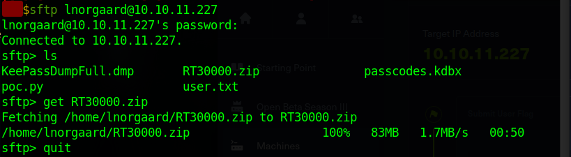
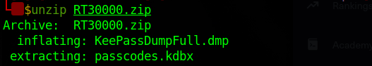
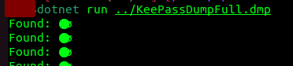
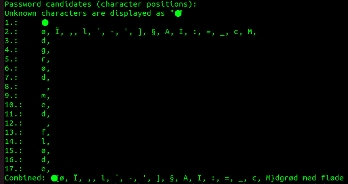
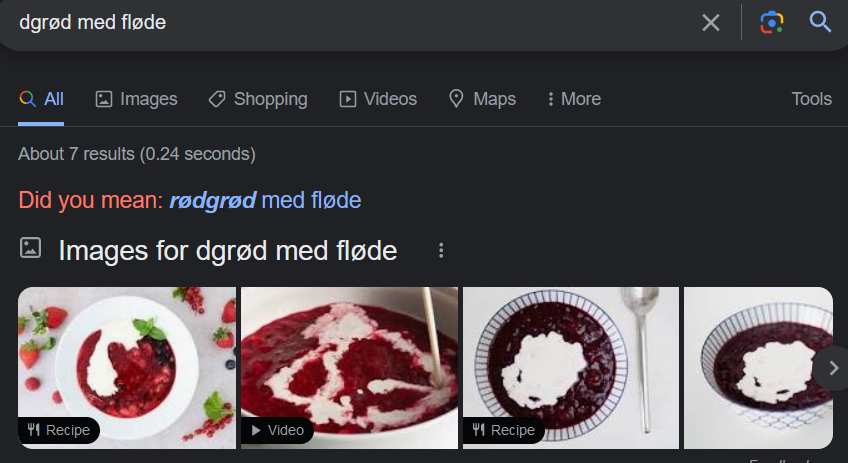
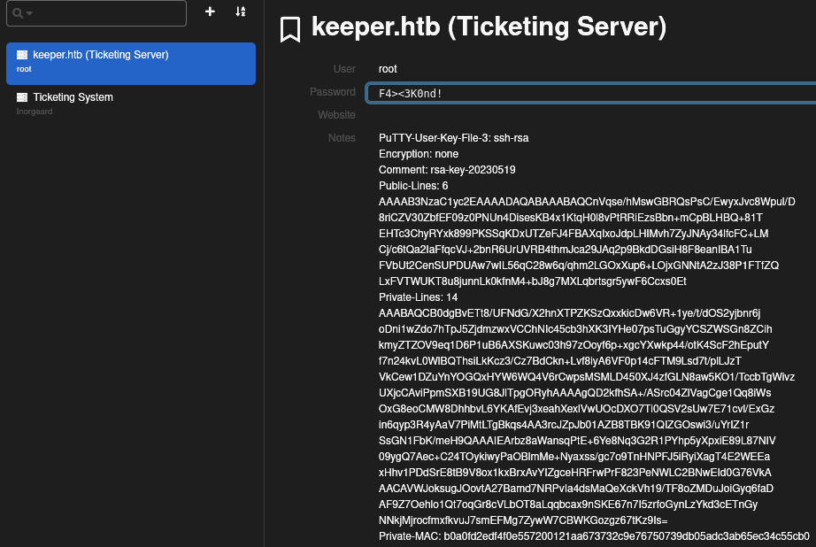
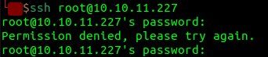
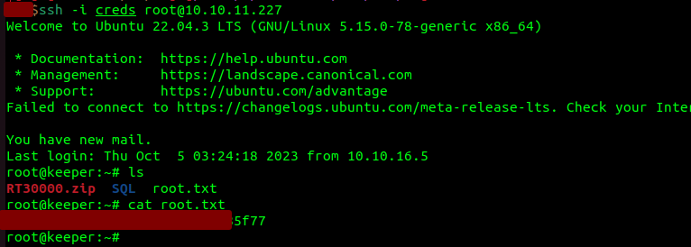

# HackTheBox-Keeper

## Reconnaissance

First, we use nmap to see what services and at what ports are open/active in the server

As we can see that SSH and HTTP are open, i checked the HTTP/web first to see what's in it.

## Web Enumeration

It appears that there's a link that we can click but we can't open it, so we add the IP and the Domain Name to our /etc/sources

Now that we can open the website, we can see that there's a login page. Since we haven't got any credentials at all, we tried common credentials and see if we can get in.

So we are able to get in using root:password, a very weak credentials being used. As we get in, we can see that there are lots of places/pages we can access. But one in particular intrigues me, and that is Admin. So i started at Admin first to see if there's something interesting in there.

When i opened Admin - Users - Create, we see that there's 2 privileged users in this website, lnorgaard and root. And we see lnorgaard first then  we see that there's an interesting comment in the page, it basically says that lnorgaard password has changed to "Welcome2023!".

Since we know that other than HTTP there's also SSH service that's open in this server, that means we can check if the lnorgaard's password is only for this website or also the credential for SSH.

## Exploitation & User Flag

and Voilà, we are able to get in the SSH as lnorgaard and we get the user flag

## Root Flag

Now that we got the user flag, we can see that there's zip file while we're using ssh.

Now we're going to copy the zip to our device, we can use multiple tools for it such as scp and sftp, but i like to use sftp.

When we unzip the file, we got KeepPassDumpFull.dmp and passcords.kdbx. So let's search for vulnerability or tool that can read/crack data from the keepass dump or crack the kdbx file.

from this site https://www.bleepingcomputer.com/news/security/keepass-exploit-helps-retrieve-cleartext-master-password-fix-coming-soon/ we can that there's a keepass dump file vulnerability and there's also the tool/exploit to test the vulnerability ourselves using "vdohney" [POC tool in their github](https://github.com/vdohney/keepass-password-dumper).

So let's try using their tool to get the something from the keepass dump file

After we downloaded the tool and then run it using `dotnet run [Path to Dump]`. We got the of seemingly at least to my eyes just random strings. The only thing that looks like a "proper" phrase/words are
> dgrød med fløde

Since i don't know what is that, so i searched on google and this came up

And it looks like that `rødgrød med fløde` is the the real password for the kdbx file. So let's try opening it with that as the password/passphrase using https://app.keeweb.info/.

And Voila, we are able to open the kdbx using the passphrase that we get, and we can see here that there's PuTTY user key file for root, but there's also password for root. Let's check if it's the password for the ssh too or it's only for the website.

So it seems like that is the password for the web or it's already changed after the keepass dumping happened. Now we only have this PuTTY-User-Key-File-3, so let's search about this putty key file on the internet and see what we find.

So from [this web](https://www.baeldung.com/linux/ssh-key-types-convert-ppk) and [this web](https://superuser.com/questions/1647896/putty-key-format-too-new-when-using-ppk-file-for-putty-ssh-key-authentication), we can that this is generated from using puttygen. From my understanding from reading those 2 websites, we can use this notes and puttygen to get the identification file or private key to be able to gain access to root using ssh.

So first i copy all the content of notes to a text file called putkeeper.txt, and then i use puttygen to get the private key/identification file from it with the output file called "creds"

After that, i use ssh and tried to login as root using the private key file using the flag -i. And VOALA, we are able to connect to server using ssh as root and we got the system flag from inside it.

