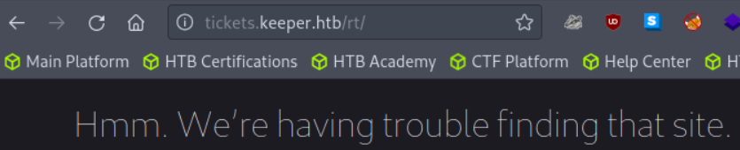

# HackTheBox-Keeper
## Reconnaissance
First, we use nmap to see what services and at what ports are open/active in the server

As we can see that SSH and HTTP are open, i checked the HTTP/web first to see what's in it.

## Web Enumeration

It appears that there's a link that we can click but we can't open it, so we add the IP and the Domain Name to our /etc/sources

Now that we can open the website, we can see that there's a login page. Since we haven't got any credentials at all, we tried common credentials and see if we can get in.

So we are able to get in using root:password, a very weak credentials being used. As we get in, we can see that there are lots of places/pages we can access. But one in particular intrigues me, and that is Admin. So i started at Admin first to see if there's something interesting in there.

When i opened Admin - Users - Create, we see that there's 2 privileged users in this website, lnorgaard and root. And we see lnorgaard first then  we see that there's an interesting comment in the page, it basically says that lnorgaard password has changed to "Welcome2023!".

Since we know that other than HTTP there's also SSH service that's open in this server, that means we can check if the lnorgaard's password is only for this website or also the credential for SSH.

## Exploitation

and Voilà, we are able to get in the SSH as lnorgaard and we get the user flag

